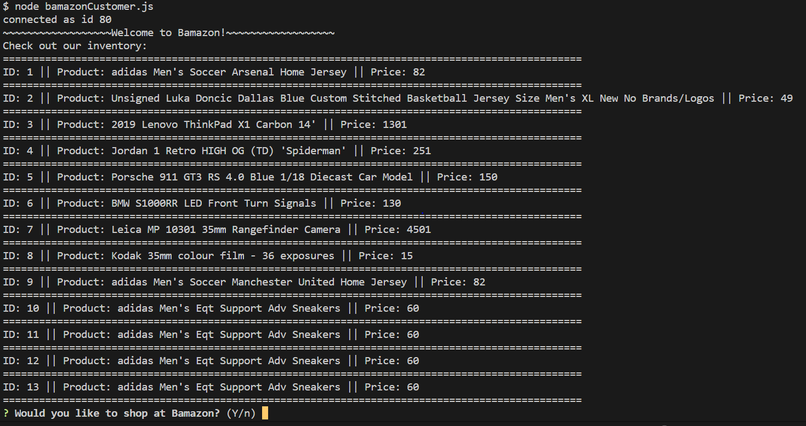
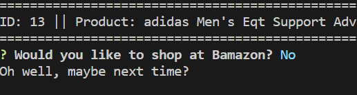
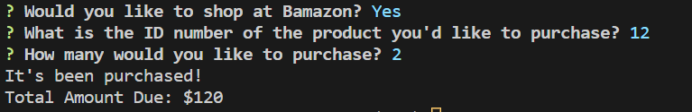
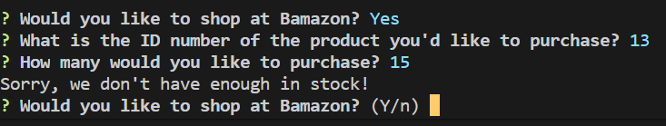

# Bamazon

Overview
In this activity, you'll be creating an Amazon-like storefront with the MySQL skills you learned this unit. The app will take in orders from customers and deplete stock from the store's inventory. As a bonus task, you can program your app to track product sales across your store's departments and then provide a summary of the highest-grossing departments in the store.

Make sure you save and require the MySQL and Inquirer npm packages in your homework files--your app will need them for data input and storage.

When loaded:
The table will populate, and the user will be asked if they would like to shop at Bamazon:

If the user says No, they will be shown "Oh well, maybe next time?":

If the user says Yes, they will be asked to pick an item ID number, and how many units they'd like to purchase. If there are enough units in stock, the user will be told "The item is purchased" and their total amount will be shown:

If the item the user selects is out of stock, they will be shown "Sorry, we don't have enough in stock", and they will be asked if they would like to shop at Bamazon again:

At the end, the database will update with the new stock quantity.
